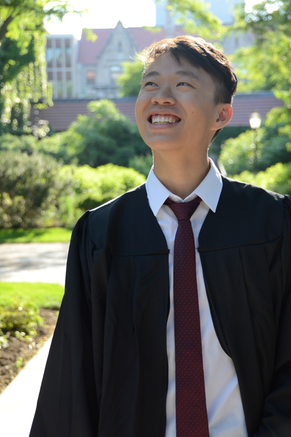

# About Me
 
I am a Thesis Track Master's student working in [Computer Science at Columbia University](http://www.cs.columbia.edu).
In June 2017, I earned my Bachelor's degree in [Mathematics at the University of Chicago](https://math.uchicago.edu).
With the knowledge and skill I've gained, I hope that I may contribute to
[human flourishing](https://mathyawp.wordpress.com/2017/01/08/mathematics-for-human-flourishing/).

## Research Interests

I am primarily interested in the **geometry of learning**. I work on
understanding machine learning and generalization theory using
perspectives from not only *statistics*, but also *algebra*,
*functional analysis*, *algebraic geometry*, and *information theory*.  

Here are some of my [reading notes](https://geelon.github.io/projects/notes)
as I work on my thesis.

### Research Motivation
My curiosity stems from an odd paradox of the *curse of
dimensionality*. The curse states that much more data is required to 
learn something statistically significant in higher dimensions. That
is, as we add more views or features into our data, the problem
becomes harder to learn. This runs counter to the intuition that if
the underlying object is of a fixed complexity, measuring more
features should make it easier to learn.

The problem is therefore that our *representation* is
high-dimensional, despite situations when the *structure* is actually
low-dimensional. This suggests that we study our data from a more
geometric perspective (c.f. coordinate-free linear algebra), where we
free ourselves from representation by studying data in concert with
the ways they behave or transform. 