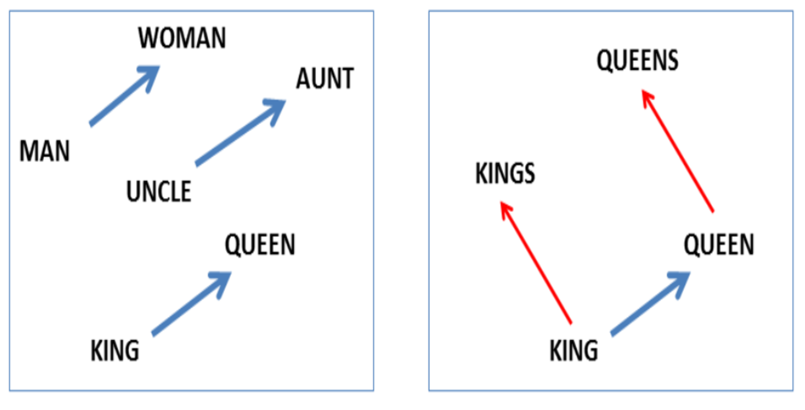
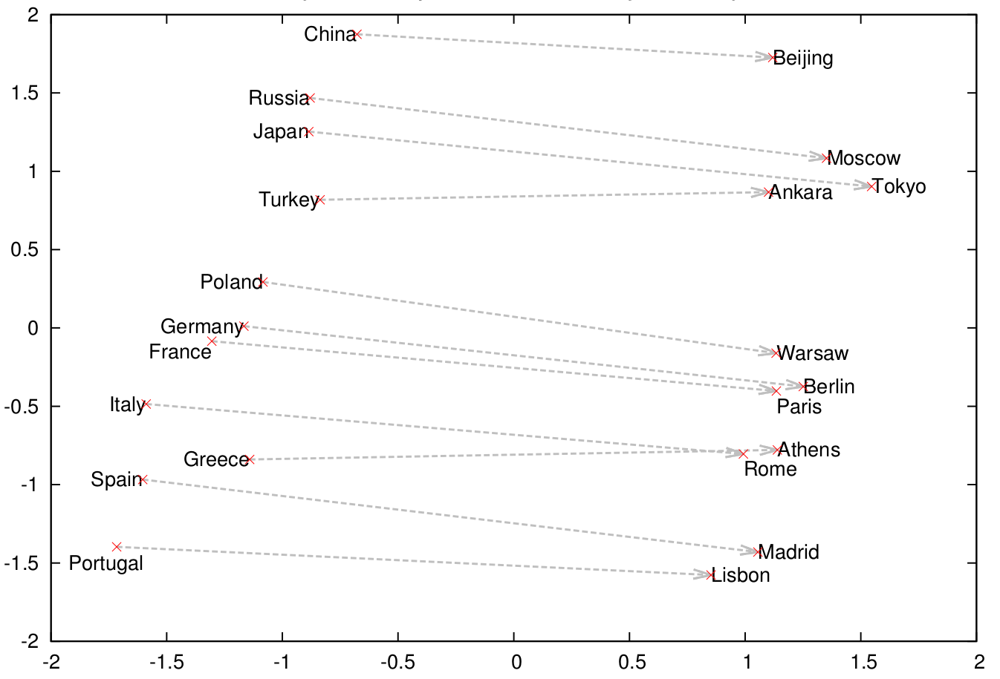
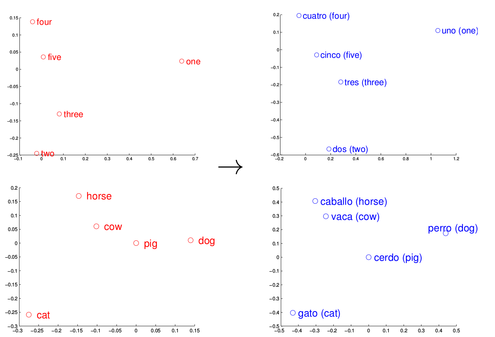
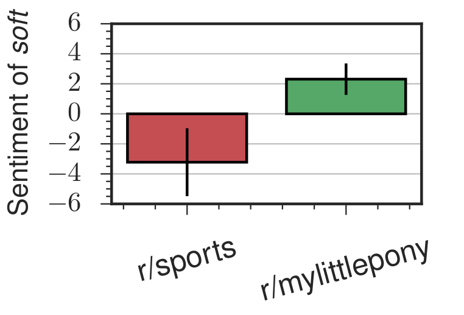
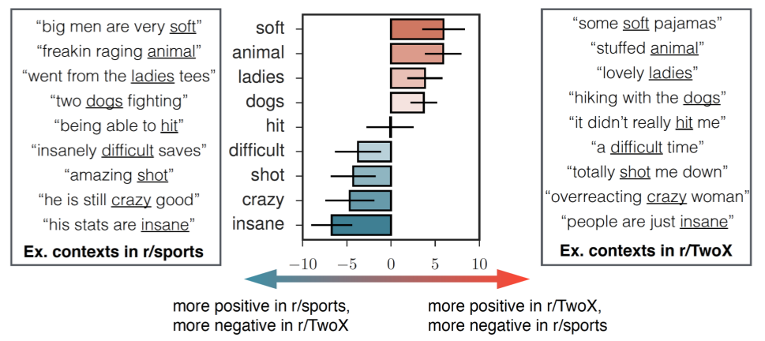
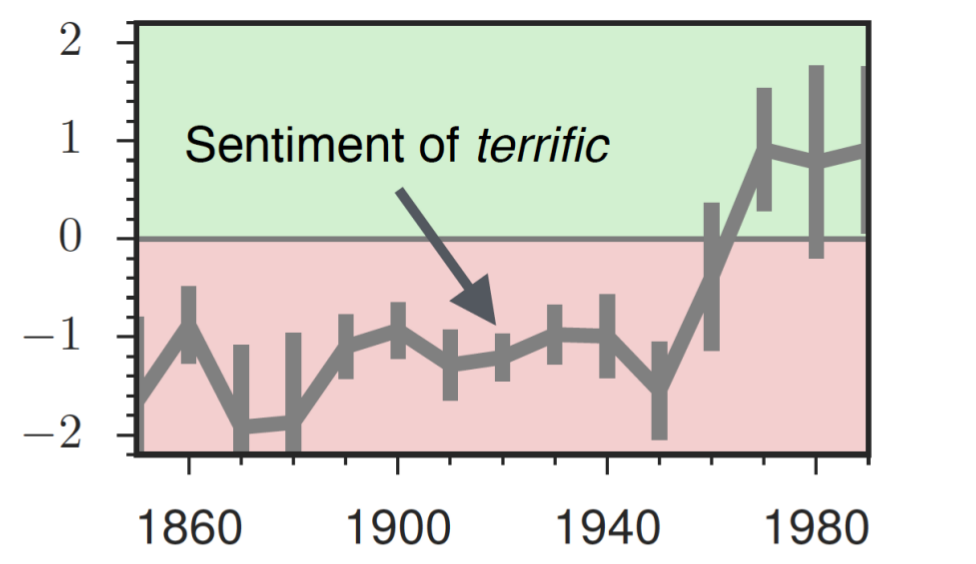
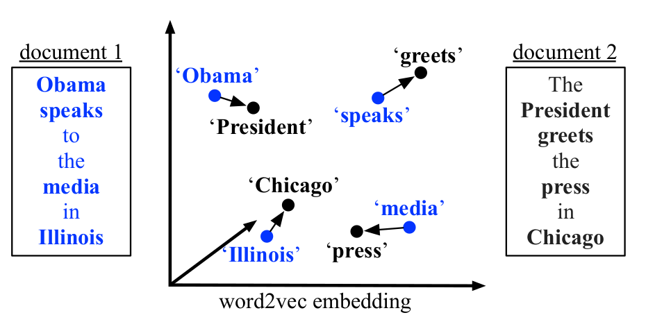
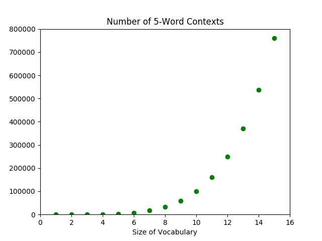
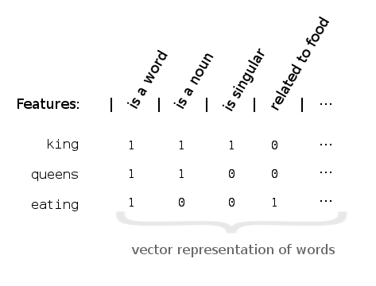
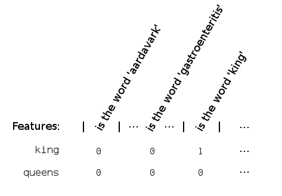

Human language is [unreasonably effective](https://en.wikipedia.org/wiki/The_Unreasonable_Effectiveness_of_Mathematics_in_the_Natural_Sciences) at describing how we relate to the world. With a few, short words, we can convey many ideas and actions with little ambiguity. Well, [mostly](http://mentalfloss.com/article/24445/10-amelia-bedelia-isms). 

But because we're capable of seeing and describing so much complexity, a lot of structure is implicitly encoded into our language. It is no easy task for a computer (or a human, for that matter) to learn *natural language*, for it entails understanding how we humans observe the world, if not understanding how *to* observe the world. 

For the most part, computers can't understand natural language. Our programs are still line-by-line instructions telling a computer what to do. And forget even that, if some blasted semicolon's gone missing.

There's good news though. There's been some important breakthroughs in *natural language processing* (NLP), the domain where researchers try to teach computers human language.

Famously, in 2013, Google researchers found a method that enabled a computer to learn relations between words such as:[^arithmetic]
$$\textrm{king} - \textrm{man} + \textrm{woman} \approx \textrm{queen}.$$
This method, called *word embeddings*, has a lot of promise; it might even be able to reveal hidden structure in the world we see. Consider one relation it [discovered](http://byterot.blogspot.in/2015/06/five-crazy-abstractions-my-deep-learning-word2doc-model-just-did-NLP-gensim.html):
$$\textrm{president} - \textrm{power} \approx \textrm{prime minister}.$$
Admittedly, this might be one of those specious relations. 

Joking aside, it's worth studying word embeddings for at least two reasons. First, there is a lot of applications and avenues for research made possible by word embeddings. Maybe we can take advantage of their capabilities if we understand what they are and what they can do. And second, we can learn from the way researchers approached the problem, seeing their thought processes as they met and overcame design challenges.

[^arithmetic]: Mikolov 2013.

<h4>Table of Contents</h4>
[INCLUDE TABLE OF CONTENTS]

## Power of Word Embeddings

Even though more research is required to understand fully why word embedding algorithms work, they do have rather impressive results. So, let's look at what they can do.

The *de facto* effect of these algorithms is **to embed words into a space that comes with its own intrinsic measures of similarity**. In particular, the chosen space is a real vector space, which importantly comes with notions of *distance* and *angle*.[^d] 

We hope that these notions extend to the embedded words in meaningful ways, quantifying relations or similarity between different words. And empirically, they actually do!

For example, the Google algorithm I mentioned above discovered certain nouns are singular/plural or have gender (Mikolov 2013abc):

<figure style="margin: 0 auto 2em;">
  
  <figcaption style="display: block; margin: 0 auto 0.55em; width: 90%;">**Figure 3.** Projections of word highlighting different relations captured by the embedding. *Image courtesy of Mikolov 2013a*.</figcaption>
</figure>

They also found a country--capital relationship:

<figure style="margin: 0 auto 2em;">
  
  <figcaption style="display: block; margin: 0 auto 0.55em; width: 90%;">**Figure 4.** The vectors of few countries and their capitals projected by PCA. *Image courtesy of Mikolov 2013c*.</figcaption>
</figure>

And as further evidence that meaning comes from the relationships a word forms, they actually found that the learned structure for one language often correlated to that of another language, perhaps suggesting the possibility for [machine translation](https://en.wikipedia.org/wiki/Machine_translation) through word embeddings (Mikolov 2013c).

<figure style="margin: 0 auto 2em;">
  
  <figcaption style="display: block; margin: 0 auto 0.55em; width: 90%;">**Figure 5.** A comparison of word relations in different languages. *Image courtesy of Mikolov 2013d*.</figcaption>
</figure>

They released their C code as the [word2vec](https://code.google.com/p/word2vec) package, and soon after, others adapted the algorithm for more programming languages. Notably, for [gensim](https://radimrehurek.com/gensim/index.html) (Python) and [deeplearning4j](https://deeplearning4j.org/word2vec) (Java).

Today, many companies and data scientists have found different ways to incorporate word2vec into their businesses and research. [Spotify](https://www.slideshare.net/eshvk/spotifys-music-recommendations-lambda-architecture) uses it to help provide music recommendation. [Stitch Fix](http://multithreaded.stitchfix.com/blog/2015/03/11/word-is-worth-a-thousand-vectors/) uses it to recommend clothing. Google is thought to use word2vec in [RankBrain](http://searchengineland.com/faq-all-about-the-new-google-rankbrain-algorithm-234440) as part of their search algorithm. 

Other researchers are using word2vec for sentiment analysis, which attempts to identify the emotions words convey. For example, one [Stanford research group](https://arxiv.org/pdf/1606.02820.pdf) looked at how the same words in different Reddit communities take on different connotations. 

<figure style="margin: 0 auto 2em;">
  

  <figcaption style="display: block; margin: 0 auto 0.55em; width: 90%;">**Figure 6.** The same word in different communities can take on different connotations. *Image courtesy of Hamilton 2016*.</figcaption>
</figure>

They can even apply the same method over time, following how the word *terrific*, which meant *horrific* for the majority of the 20th century, has come to mean *great* today. 

<figure style="margin: 0 auto 2em;">

  <figcaption style="display: block; margin: 0 auto 0.55em; width: 90%;">**Figure 7.** The evolution of the word *terrific* over time. *Image courtesy of Hamilton 2016*.</figcaption>
</figure>

As a light-hearted example, one [research group](http://www.pelleg.org/shared/hp/download/fun-facts-wsdm.pdf) used word2vec to help them determine whether a fact is surprising or not, so that they could automatically generate trivia facts.

The successes of word2vec have also helped spur on other forms of word embedding---[WordRank](https://arxiv.org/pdf/1506.02761.pdf), Stanford's [GloVe](https://nlp.stanford.edu/projects/glove/), and Facebook's [fastText](https://research.fb.com/projects/fasttext/), to name a few major ones. But not only do other algorithms seek to improve on word2vec, they also look at texts through different *units*: characters, subwords, words, phrases, sentences, documents, and even perhaps thought.[^thought] As a result, they allows us to think about not just word similarity, but also sentence similarity and document similarity---like this paper did (Kusner 2015):

<figure style="margin: 0 auto 2em;">

  <figcaption style="display: block; margin: 0 auto 0.55em; width: 90%;">**Figure 8.** The calculation that determines how similar two sentences are. *Image courtesy of Kusner 2015*.</figcaption>
</figure>

Word embeddings **transform human language meaningfully into a form conducive to numerical analysis**. In doing so, they allow computers to explore the wealth of knowledge encoded implicitly into our own ways of speaking. Although the lexical data we can now access may give way to remarkable insight, it is unremarkable that there should be so many applications. In fact, we've barely scratched the surface.

There's great potential, though, for any individual programmer or scholar to use these tools and contribute new knowledge. Many areas of research and industry that could benefit from NLP have yet to be explored. Word embeddings and neural language models are powerful techniques. But perhaps the most powerful aspect of machine learning is its collaborative culture. Many, if not most, of the state-of-the-art methods are open-source, along with their accompanying research.[^open]

So, it's there, if we want to take advantage. Now, the main obstacle is just ourselves. And...maybe an expensive GPU.[^cheap]

[^d]: To connect back to the previous section, we can think of the dimension $d$ as the number of features we use to encode each word.

[^thought]: 
A "thought vector" is a new concept to represent an idea, perhaps more general than a word. Here is a blog post on thought vectors on [deeplearning4j](https://deeplearning4j.org/thoughtvectors), and here's an research article on [skip-thought vectors](https://arxiv.org/pdf/1506.06726.pdf). Here's a neat result from the latter article: out of a 500,000-sentences corpus, their algorithm could find semantically- and syntactically-near sentences. For example, "im sure youll have a glamorous evening, she said, giving an exaggerated wink" and "im really glad you came to the party tonight, he said, turning to her".

[^open]: In fact, not a single one the references I used is behind a paywall.

[^cheap]: 
Although, you could consider cloud services like [Amazon Web Services](https://aws.amazon.com/)!

## Problem and Theory

See if you can guess what the word *wapper* means from how it's used in the following two sentences:

1. After running the marathon, I could barely keep my legs from wappering.
2. Thou'll not see Stratfort to-night, sir, thy horse is wappered out. (Or perhaps a more modern take: I can't drive you to Stratford tonight for I'm wappered out).

The second example is from the [Oxford English Dictionary](http://www.oed.com/view/Entry/225584) entry. If you haven't guessed, the word was probably more popular in the late-19th century. But it means *to shake, especially from fatigue* (and it might share the same linguistic roots as *to waver*).

By now, you likely have a pretty good understanding of what *to wapper* means, if you like, even creating new sentences. Impressively, you probably didn't need me to explicitly tell you the definition; indeed, how many words in *this* sentence did you learn by reading a dictionary entry? We learn what words mean from their surrounding *contexts*.

This implies that even though it appears that the meaning of a word is intrinsic to the word, **some of the meaning of a word also exists in its context**. 

Words, like notes on an instrument, do have their individual tones. But it is their relationship with each other---their interplay---that gives way to fuller music. Context enriches meaning.

So, take a context,
$$\textrm{After running the marathon, I could barely keep my legs from ____________.}$$
We should have a sense of what words could fill the blank. Much more likely to appear are words like *shaking*, *trembling*, and of course, *wappering*. Especially compared to nonsense like *pickled*, *big data*, or even *pickled big data*.

In short, the higher probability of appearing in this context corresponds to greater shared meaning. From this, we can deduce the [distributional hypothesis](https://en.wikipedia.org/wiki/Distributional_semantics#Distributional_hypothesis): words that share *many* contexts tend to have similar meaning.

What does this mean for a computer trying to understand words?

Well, if it can estimate how likely a word is to appear in different contexts, then for most intents and purposes, the computer has learned the meaning of the word.[^philosophical] Mathematically, we want to approximate the probability distribution of
$$p(\textrm{ word } | \textrm{ context }) \quad\textrm{ or }\quad p(\textrm{ context }|\textrm{ word }).$$

Then, the next time the computer sees a specific context $c$, it can just figure out which words have the highest probability of appearing, $p(\textrm{ word }|\ c\ )$.

[^philosophical]: And let's not get into any philosophical considerations of whether the computer really *understands* the word. Come to think of it, how do I even know you understand a word of what I'm saying? Maybe it's just a matter of serendipity that the string of words I write make sense to you. But here I am really talking about how to oil paint clouds, and you think that I'm talking about machine learning.

### Challenges

The straightforward and naive approach to approximating the probability distribution is:

- step 1: obtain a huge training corpus of texts,
- step 2: calculate the probability of each `(word,context)` pair within the corpus.

The underlying (bad) assumption? The probability distribution learned from the training corpus will approximate the theoretical distribution over all word-context pairs.

However, if we think about it, the number of contexts is so great that the computer will never see a vast majority of them. That is, many of the probabilities $p(\textrm{ word } |\ c\ )$ will be computed to be 0. This is mostly a terrible approximation.

The problem we've run into is the **curse of dimensionality**. The number of possible contexts grows exponentially relative to the size of our vocabulary---when we *add* a new word to our vocabulary, we more or less *multiply* the number of contexts we can make.[^exponential]

<figure style="margin: 0 auto 2em;">
  
  <figcaption style="display: block; margin: 0 auto 0.55em; width: 90%;">**Figure 1.** The exponential growth of the number of contexts with respect to the number of words.</figcaption>
</figure>

We overcome the curse of dimensionality with *word embeddings*, otherwise known as **distributed representations of words**. Instead of focusing on words as individual entities to be trained one-by-one, we focus on the attributes or *features* that words share. 

For example, *king* is a noun, singular and masculine. Of course, many words are masculine singular nouns. But as we add more features, we narrow down on the number of words satisfying each of those qualities. 

Eventually, if we consider enough features, the collection of features a word satisfies will be distinct from that of any other word.[^features] This lets us uniquely represent words by their features. As a result, we can now train features instead of individual words.[^distributed] 

This new type of algorithm would learn more along the lines of *in this context, nouns having such and such qualities are more likely to appear* instead of *we're more likely to see words X, Y, Z*. And since many words are nouns, each context teaches the algorithm a little bit about many words at once.

In summary, every word we train actually recalls a whole network of other words. This allows us to overcome the exponential explosion of word-context pairs by training an exponential number of them at a time.[^bengio]

[^exponential]:
Consider a 20-word context. If we assume that the average English speaker's vocabulary is 25,000 words, then the increase of 1 word corresponds to an increase of about $7.2\times 10^{84}$ contexts, which is actually more than the [number of atoms](https://en.wikipedia.org/wiki/Observable_universe#Matter_content) in the universe. Of course, most of those contexts wouldn't make any sense.

[^features]: The algorithm used by the Google researchers mentioned above assumes 300 features.

[^distributed]: 
The term *distributed representation of words* comes from this: we can now represent words by their features, which are shared (i.e. distributed) across all words. We can imagine the representation as a *feature vector*. For example, it might have a 'noun bit' that would be set to 1 for nouns and 0 for everything else. This is, however, a bit simplified. Features can take on a spectrum of values, in particular, any real value. So, feature vectors are actually vectors in a real vector space.

[^bengio]: The distributed representations of words "allows each training sentence to inform the model about an exponential number of semantically neighboring sentences," (Bengio 2003).

### A New Problem

In theory, representing words by their features can help solve our dimensionality problem. But, how do we implement it? Somehow, we need to be able to turn every word into a unique *feature vector*, like so:
<figure style="margin: 0 auto 2em;">
  
  <figcaption style="display: block; margin: 0 auto 0.55em; width: 90%;">**Figure 1.** The feature vector of the word *king* would be $\langle 1, 1, 1,0,\dotsc\rangle$.</figcaption>
</figure>

But features like *is a word* isn't very helpful; it doesn't contribute to forming a *unique* representation. One way to ensure uniqueness is by looking at a whole lot of specific features. Take *is the word 'king'* or *is the word 'gastroenteritis'*, for example. That way, every word definitely corresponds to a different feature vector:

<figure style="margin: 0 auto 2em;">
  
  <figcaption style="display: block; margin: 0 auto 0.55em; width: 90%;">**Figure 2.** An inefficent representation defeating the purpose of word embeddings.</figcaption>
</figure>

This isn't a great representation though. Not only is this a very inefficient way to represent words, but it also fails to solve the original dimensionality problem. Although every word still technically recalls a whole network of words, each network contains only one word!

Constructing the right collection of features is a hard problem. They have to be not too general, not too specific. The resulting representation of each word using those features should be unique. And, we should limit the number of features to between 100-1000, usually. 

Furthermore, even though it's simpler to think about binary features that take on True/False values, we'll actually want to allow a spectrum of feature values. In particular, any real value. So, feature vectors are also actually vectors in a real vector space.

### A New Solution

The solution to feature construction is: don't. At least not directly.[^nobit] 

Instead, let's revisit the probability distributions from before:
$$p(\textrm{ word }|\textrm{ context }) \quad\textrm{and}\quad p(\textrm{ context }|\textrm{ word }).$$
This time, words and contexts are represented by feature vectors:
$$\textrm{word}_i = \langle \theta_{i,1}, \theta_{i,2}, \dotsc, \theta_{i,300}\rangle,$$
which are just a collection of *numbers*. This turns the probability distributions from a functions over categorical objects (i.e. individual words) into a function over numerical variables $\theta_{ij}$. This is something that allows us to bring in a lot of existing analytical tools---in particular, *neural networks* and other optimization methods.

The short version of the solution: from the above probability distributions, we can calculate the probability of seeing our training corpus, $p(\textrm{corpus})$, which had better be relatively large. We just need to find the values for each of the $\theta_{ij}$'s that maximize $p(\textrm{corpus})$.

These values for $\theta_{ij}$ give precisely the feature representations for each word, which in turn lets us calculate $p( \textrm{ word }|\textrm{ context })$. Recall that this in theory teaches a computer the meaning of a word.

The burning question now: did it work? Those of you wanting to know, go ahead and skip the next section, down to [Uses for Word Embeddings](#uses-for-word-embeddings). Those who'd like a bit more mathematical detail, burn on!

[^nobit]: This also means that there's probably not a 'noun bit' in our representation, like in the figures above. There might not be any obvious meaning to each feature.

### A Bit of Math

In this section, I'll give enough details for the interested reader to go on and understand the literature with a bit more ease. 

Recall from previously, we have a collection of probability distributions that are functions over some $\theta_{ij}$'s. The literature refers to these $\theta_{ij}$'s as *parameters* of the probability distributions $p(w|c)$ and $p(c|w)$. The collection of parameters $\theta_{ij}$'s is often denoted by a singular $\theta$, and the parametrized distributions by $p(w|c;\theta)$ and $p(c|w;\theta)$.[^softmax]

If the goal is to maximize the probability of the training corpus, let's first write $p(\textrm{corpus};\theta)$ in terms of $p(c|w;\theta)$. 

There are a few different approaches. But in the simplest, we think of a training corpus as an ordered list of words, $w_1, w_2, \dotsc, w_T$. Each word in the corpus $w_t$ has an associated context $C_t$, which is a collection of surrounding words.

<figure style="margin: 0 auto 2em; border-style:solid;">
\begin{align*}
\textrm{corpus: }\quad w_1\ | \ w_2\ | \ w_3\ | \quad \dotsm \quad & w _t \quad \dotsm \quad |\ w_{T-2} \ | \ w_{T-1} \ | \ w_T\\
& \,\Big\downarrow\\
\textrm{context of $w_t$: }\quad \big[ w_{t-n}\ \dotsm\ w_{t-1}\big]\ &w_t \ \big[w_{t+1}\ \dotsm\  w_{t+n} \big]
\end{align*}
<figcaption style="display: block; margin: 0 auto 0.55em; width: 90%;">**Diagram 1.** A corpus is just an ordered list of words. The context $C_t$ of $w_t$ is a collection of words around it.[^hyperparameter] </figcaption>
</figure>

For a given word $w_t$ in the corpus, the probability of seeing another word $w_c$ in its context is $p(w_c|w_t;\theta)$. Therefore, the probability that a word sees all of the surrounding context words $w_c$ in the training corpus is
$$\prod_{w_c \in C_t} p(w_c|w_t;\theta).$$
To get the total probability of seeing our training corpus, we just take the product over all words in the training corpus. Thus,
$$p(\textrm{corpus};\theta) = \prod_{w_t}\prod_{w_c \in C_t} p(w_c|w_t;\theta).$$

Now that we have the objective function, $f(\theta) = p(\textrm{corpus};\theta)$, it's just a matter of choosing the parameters $\theta$ that maximize $f$.[^log] Depending on how the probability distribution is parametrized by $\theta$, this optimization problem can be solved using neural networks. For this reason, this method is also called a [neural language model](https://en.wikipedia.org/wiki/Language_model#Neural_language_models) (NLM). 

There are actually more layers of abstraction and bits of brilliance between theory and implementation. While I hope that I've managed to give you some understanding on where research is proceeding, the successes of the current word embedding methods are still rather mysterious. The intuition we've developed on the way is still, as Goldberg, et. al. wrote, "very hand-wavy" (Goldberg 2014).

Still, perhaps this can help you have some intuition for what's going on behind all the math when reading the literature. A lot more has been written on this subject too; you can also take a look at the end of the article where I list more [resources](#resources-&-references) I found useful.

[^nn]:
We can use neural networks to simultaneously discover the features and represent the words in terms of those features. See the appendix of [this paper](https://arxiv.org/pdf/1411.2738.pdf) for more details on neural networks applied to the word embedding problem. The rest of the paper also explains the word2vec's word embedding algorithm by Mikolov, et. al. 2013 (Rong 2014).

[^hyperparameter]:
One can control the algorithm by specifying different hyperparameters: do we care about order of words? How many surrounding words do we consider? And on.

[^log]:
This maximization problem is often equivalently written as
$$\operatorname*{arg\,max}_\theta \sum_{w_t} \sum_{C_t} \log p(w_c|w_t;\theta).$$

[^softmax]:
The [softmax function](https://en.wikipedia.org/wiki/Softmax_function) is often chosen as the ideal probability distribution. Let $w_t$ be the vector representation of a word, and let $C_t$ be the collection of words that have appeared in the context of $w_t$.  Then,
$$p(w_c|w_t;\theta) = \frac{e^{w_c \cdot w_t}}{\sum_{w_{c'} \in C_t} e^{w_{c'} \cdot w_t}}.$$
But other related functions are used in practice (for computational reason). The point here is that the parameters $\theta$ are then optimized with respect to the selected distribution function.

## Resources & References

I focused mainly on word2vec while researching neural language models. However, do keep in mind that word2vec was just one of the earlier and possibly more famous models. To understand the theory, I quite liked all of the following. Approximately in order of increasing specificity,

- Radim Řehůřek's [introductory post](https://rare-technologies.com/deep-learning-with-word2vec-and-gensim/) on word2vec. He also wrote and optimized the word2vec algorithm for Python, which he notes sometimes exceeds the performance of the original C code.
- Chris McCormick's [word2vec tutorial series](http://mccormickml.com/2016/04/19/word2vec-tutorial-the-skip-gram-model/), which goes into much more depths on the actual word2vec algorithm. He writes very clearly, and he also provides a list of resources.
- Goldberg and Levy 2014, [word2vec Explained](https://arxiv.org/abs/1402.3722), which helped me formulate my explanations above.
- Sebastian Ruder's [word embedding series](http://ruder.io/word-embeddings-1/index.html). I found this series comprehensive but really accessible.
- Bojanowski 2016, [Enriching word vectors with subword information](https://arxiv.org/pdf/1607.04606.pdf). This paper actually is for Facebook's fastText (which Mikolov is a part of), but it is based in part on word2vec. I found the explanation of word2vec's model in Section 3.1 transparent and concise.
- Levy 2015, [Improving distributional similarity with lessons learned from word embeddings](https://levyomer.files.wordpress.com/2015/03/improving-distributional-similarity-tacl-2015.pdf) points out that actually, the increased performance of word2vec over previous word embeddings models might be a result of "hyperparameter optimizations," and not necessarily in the algorithm itself.

Listed here are the references I cited above.

[[Bengio 2003](http://www.jmlr.org/papers/volume3/bengio03a/bengio03a.pdf)] Bengio, Yoshua, et al. "A neural probabilistic language model." Journal of machine learning research 3.Feb (2003): 1137-1155.

[[Bojanowski 2016](https://arxiv.org/pdf/1607.04606.pdf)] Bojanowski, Piotr, et al. "Enriching word vectors with subword information." arXiv preprint arXiv:1607.04606 (2016).

[[Goldberg 2014](https://arxiv.org/pdf/1402.3722.pdf)] Goldberg, Yoav, and Omer Levy. "word2vec Explained: deriving Mikolov et al.'s negative-sampling word-embedding method." arXiv preprint arXiv:1402.3722 (2014).

[[Goodfellow 2016](http://www.deeplearningbook.org/)] Goodfellow, Ian, Yoshua Bengio, and Aaron Courville. Deep learning. MIT press, 2016.

[[Hamilton 2016](https://arxiv.org/pdf/1606.02820.pdf)] Hamilton, William L., et al. "Inducing domain-specific sentiment lexicons from unlabeled corpora." arXiv preprint arXiv:1606.02820 (2016).

[[Kusner 2015](https://arxiv.org/pdf/1506.06726.pdf)] Kusner, Matt, et al. "From word embeddings to document distances." International Conference on Machine Learning. 2015.

[[Levy 2015](https://levyomer.files.wordpress.com/2015/03/improving-distributional-similarity-tacl-2015.pdf)] Levy, Omer, Yoav Goldberg, and Ido Dagan. "Improving distributional similarity with lessons learned from word embeddings." Transactions of the Association for Computational Linguistics 3 (2015): 211-225.

[[Mikolov 2013a](http://www.aclweb.org/anthology/N13-1090)] Mikolov, Tomas, Wen-tau Yih, and Geoffrey Zweig. "Linguistic regularities in continuous space word representations." hlt-Naacl. Vol. 13. 2013.

[[Mikolov 2013b](https://arxiv.org/pdf/1301.3781.pdf)] Mikolov, Tomas, et al. "Efficient estimation of word representations in vector space." arXiv preprint arXiv:1301.3781 (2013).

[[Mikolov 2013c](https://arxiv.org/pdf/1310.4546.pdf)] Mikolov, Tomas, et al. "Distributed representations of words and phrases and their compositionality." Advances in neural information processing systems. 2013.

[[Mikolov 2013d](https://arxiv.org/pdf/1309.4168.pdf)] Mikolov, Tomas, Quoc V. Le, and Ilya Sutskever. "Exploiting similarities among languages for machine translation." arXiv preprint arXiv:1309.4168 (2013).

[[Mnih 2012](https://arxiv.org/pdf/1206.6426.pdf)] Mnih, Andriy, and Yee Whye Teh. "A fast and simple algorithm for training neural probabilistic language models." arXiv preprint arXiv:1206.6426 (2012).

[[Rong 2014](https://arxiv.org/pdf/1411.2738.pdf)] Rong, Xin. "word2vec parameter learning explained." arXiv preprint arXiv:1411.2738 (2014).

